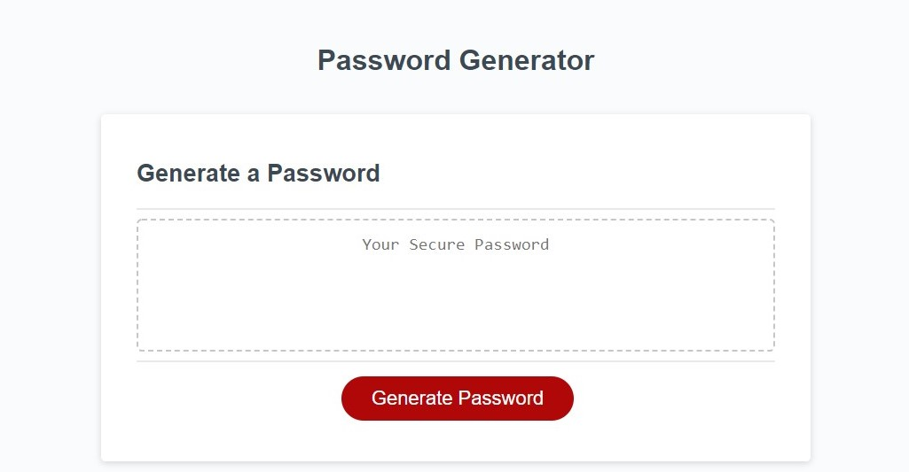
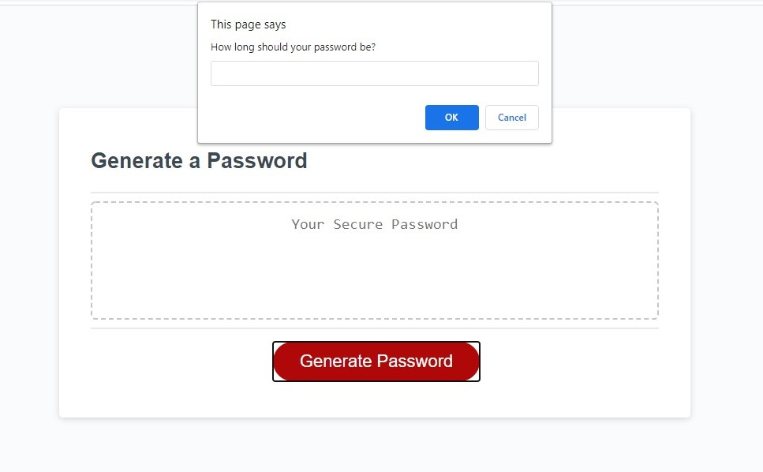
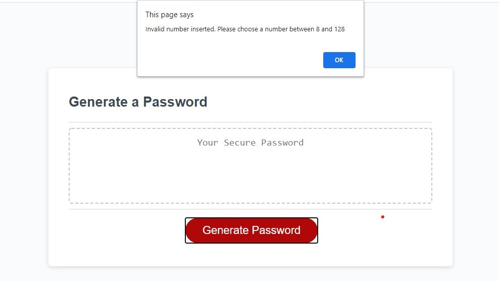
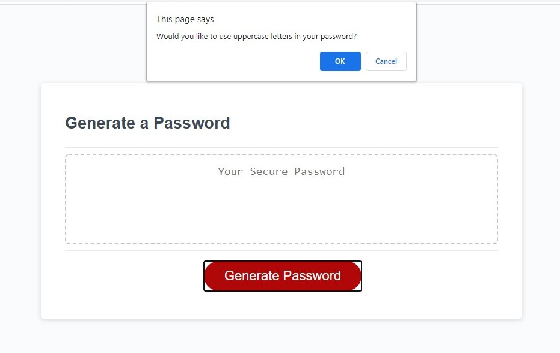
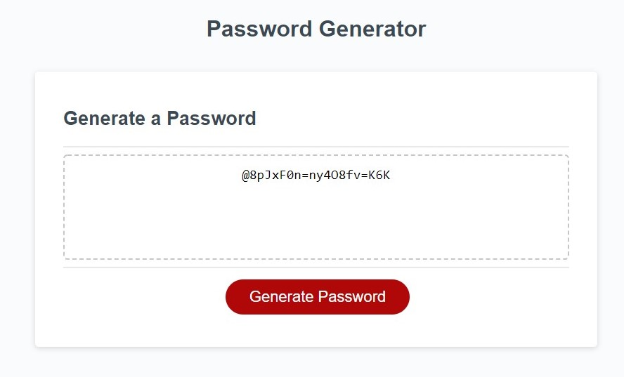

# Password Generator

## Description

This application has been created to generate random, strong, and safe passwords. The user is presented with few questions on the application that permits them to decide which type of character should be included in the password. The options are the following:

- If the user would like to use **uppercase letters**;
- If the user would like to use **lowercase letters**;
- If the user would like to use **numbers**;
- Or if the user would like to use **special characters**.

Below are the steps to generate random and secure passwords, as well as screenshot of some of the features for reference.

- Password generator webpage.

  

- When the user clicks the generate password button, a prompt asking for the password length will open on the window.

  

- The number of characters should be between 8 and 128 for the password to be generated. If the user doesn't choose a number between 8 and 128 or if the box is left empty then an alert will show on the window and the process will have to be repeated.

  

- After the user chooses a valid password length a window will open to confirm if the user would like to include uppercase/lowercase/number and/or special characters.

  

- After all the questions are answered the password will be generated following the user's choices and displayed on the white box.

  

## Built With

- HTML
- CSS
- JavaScript

## Website

https://andybuzzi.github.io/password-generator/
